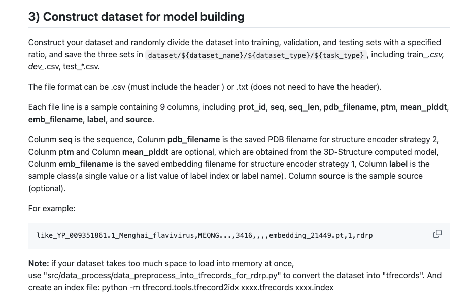

# Week1 学习总结 - 数据处理与加载优化

## 1. 数据处理

### 1.1 HuggingFace Datasets 数据加载与处理教程
- 数据加载，数据清洗，过滤，标签转换。
- 示例：将数据处理成 lucaprot 可使用的格式。

### 1.2 lucaprot 如何处理数据集

## 2. 超大数据集 加载与内存优化

### 2.1 HuggingFace 大内存加载
- **内存映射 (memory-mapped)**：解放内存管理问题。
- **流式处理 (streaming)**：摆脱硬盘限制。

### 2.2 lucaprot 加载
- 处理方式过于复杂，在前期学习中可以暂时忽略。

## 3. 遇到的问题与解决方案

### 3.1 训练与推理的不同
- **训练**：
  - 学习。
  - 显存占用高，策略是切碎学习。
- **推理**：
  - 使用。
  - 显存占用低，策略是拼完整。

### 3.2 对于长序列的处理

#### 3.2.1 参考 ESM3
- **连续随机裁剪 (Contiguous Cropping)**：将训练序列长度限制在 512 或 1024。

#### 3.2.2 长序列处理
- 开启 Gradient Checkpointing。
- 配合使用 Gradient Accumulation（Batch Size 设为 1，累积 32 步更新一次）。

## 4. 超大型数据集的 embedding 计算思路
- 流式读取 CSV → 分块处理（每块 N 条） → ESM-2 批量推理 → 保存 embedding 到磁盘 → 清理显存 → 下一块。

## 5. 常用工具与函数

### 5.1 PyTorch 模型切换
- **model.eval()**：将模型切换到评估模式，常用于验证或推理阶段。
- **torch.no_grad()**：禁用梯度计算，节省内存和计算资源。

### 5.2 enumerate 函数
- 用于将可迭代对象组合为索引序列，常用于 for 循环中获取元素的索引和值。

## 6. 学习到的内容
- 微调阶段：
  - 面对大量数据集时只能采用流式处理，不能使用 map 内存映射方法进行批量处理。原因：
    - 微调阶段需要频繁访问数据集中的不同部分，内存映射方法会导致频繁的磁盘 I/O，影响训练效率。
    - 流式处理可以按需加载数据，减少内存占用，提高训练速度。
- 推理阶段：
  - 可以采用流式处理，避免加载整个数据集到内存中。

---
