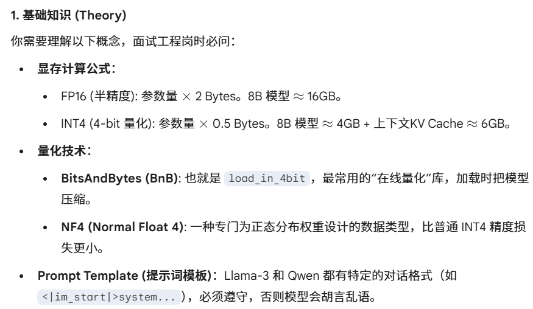

本周计划:
安装一个 回答型的大模型 Llama（Mete AI），我用-qwen

前期调研：打造一个知识回答型的gpt。现在序列识别已经完成，问答qwen-2.5B与知识库。

问AI问题：
虚拟环境安装包要分开
我在ec2上部署，如何把他映射到端口，远程访问？

huggingface的readme看不懂
对于部署，我们推荐使用SGLang和vLLM等框架
对于本地使用，我们强烈推荐使用Ollama、LMStudio、MLX、llama.cpp和KTransformers等工具
本地使用：
    部署到本地的方式。
量化推理加速框架：
    旨在优化大型语言模型（LLM）的推理效率。例如说API访问，不用vLLM可能会卡死。
    比 vLLM 更新的框架，专门针对“复杂的连续提问”做了加速

# 1执行
任务：搞懂模型是怎么加载的、Token 是什么、量化参数怎么设。
    load model：
        config.json 模型权重相关
        .safetensors 或 .bin
        bitsandbytesconfig 
        分发GPU
    what is token？
        Tokenization
        vocabulary id
        embedding（长度填充）
    量化参数怎么设
        压缩解压格式

# 2代码
在构建模型时，BitsAndBytesConfig是啥？
    [text](https://zhuanlan.zhihu.com/p/665601576)

# 3知识
Llama

https://zhuanlan.zhihu.com/p/643894722 Llama model paper
vLLM

# 4经验
1 单Qwen2.5B模型，需要8G显存
2 不会写代码的解决方法：
    2.1 先写中文版的pipeline
    2.2 用def确定骨架
    2.3 在骨架内填充关键参数

为了检验你对当前 **Month 2（LLM 部署与 RAG）** 阶段以及未来 **工程岗** 要求的掌握程度，请尝试回答以下问题。这些问题涵盖了从底层原理到实际工程场景的考量：

### 一、 量化与显存工程 (Quantization & Memory)

* **计算推演**：如果你有一张 24GB 显存的显卡，尝试部署一个 Llama-3-70B 模型（FP16 全精度约为 140GB），使用 4-bit 量化能否跑得动？如果跑不动，最少需要几张这样的显卡？
* **底层原理**：在 `BitsAndBytesConfig` 中，为什么 `bnb_4bit_compute_dtype` 通常设为 `float16` 而不是直接用 `int4` 进行计算？
* **性能权衡**：量化虽然省了显存，但为什么在某些情况下推理速度（Tokens per second）反而可能比全精度模型慢？
* **进阶概念**：什么是 **KV Cache**？它对显存的占用与对话长度（Context Length）是什么关系？

### 二、 RAG 与向量数据库 (RAG & Vector DB)

* **分块策略**：在处理长篇 CRESS 病毒文献时，`chunk_size`（切片大小）设得太大或太小分别会有什么工程隐患？
* **检索瓶颈**：如果 RAG 系统找回了不相关的文献片段，导致模型胡言乱语，你会从哪些维度去优化检索质量（Retrieval Quality）？
* **工具对比**：在本地单机使用时，为什么选择 `FAISS` 这种向量库，而不是像 `Pinecone` 这样的云端向量数据库？
* **多模态挑战**：如果你的生物论文里有大量的蛋白质结构图或实验数据表，传统的 `PyPDFLoader` 提取出来的文本还能保证 RAG 的准确性吗？

### 三、 模型服务化与工程化 (Serving & Engineering)

* **接口封装**：如何将你写的 Python 脚本改造成一个可以被前端调用的 **API 接口**（如使用 FastAPI）？
* **并发处理**：如果有 5 个用户同时向你的 `chat_test.py` 发起提问，目前的脚本会发生什么？如何利用 `vLLM` 的 **Continuous Batching** 技术解决这个问题？
* **环境隔离**：在 AWS 生产环境中，如何使用 `Docker` 来打包你的 `mouth2` 环境，确保代码在任何机器上都能直接运行而不会报 MKL 错误？

### 四、 生物 AI 交叉领域 (Bio-AI Specific)

* **Tokenization 差异**：自然语言模型（如 Qwen）的 Tokenizer 与生物序列模型（如 ESM-2）的 Tokenizer 在处理输入时有什么本质区别？
* **Prompt Engineering**：如何设计一个 System Prompt，能让通用大模型更专业地辅助你分析 CRESS 病毒的 Rep 蛋白序列，而不是给出笼统的生物学定义？
* **流程整合**：你会如何设计一个自动化的 Pipeline，实现“上传病毒序列 -> 自动查阅 RAG 文献库 -> 自动调用 ESM-2 预测突变效果 -> 输出中文总结报表”？

---

**你想针对以上哪一组问题进行深度解答，或者需要我为你提供这些问题的标准“面试级”参考答案？**